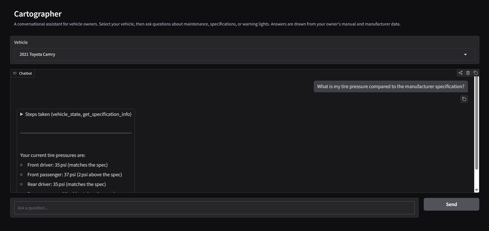

# cartographer

Cartographer is a conversational AI assistant for vehicle owners (a play on **car**tographer). Ask it anything about your car and it figures out whether to search your owner's manual via RAG, check your vehicle's current state, or pull from manufacturer specs. The tool is designed primarily for car owners, not service technicians.



**Stack:** Python - LangGraph - Groq - Qdrant - FastAPI - Gradio - Docker - AWS ECS/ECR - Terraform

# Architecture
The architecture of the app is designed to work in either a local on-device setting or a cloud infrastructure deployment.

## Structured application breakdown

### Services

Each service lives as a separate micro-app, allowing for load-balancing scaling on a network-level

#### Ingestion

Takes in new owner's manuals or other relevant documents.

The service performs the following tasks:
1. Parses PDFs
1. Chunks text using overlapping windows
1. Embeds each text chunk into vector store for semantic similarity lookup by other services

#### Query

Queries a model with the relevant information.

The service performs the following tasks:
1. Creates system prompt
1. Provides context to model of available tool calls
1. Provides context to model with user's garage configuration
1. Queries cloud provided-LLM
1. Repeat until conversation over

##### Query tools
The query model has the currently available tools

- search_manual: RAG from documents
- get_specification_info: Specification lookup
- vehicle_state: Vehicle State

#### Frontend

Serves template via html for user to interact with

# Deploying

## First deploy

```sh
cd infra
cp terraform.tfvars.example terraform.tfvars
# fill in groq_api_key and my_ip_cidr, then:
terraform init
terraform apply
```

After apply, push Docker images to ECR and populate the auth users secret (see below).

## Managing users

Auth credentials are stored in AWS Secrets Manager under `cartographer/frontend-auth-users` as a JSON object of `username -> bcrypt hash` pairs. Terraform creates the secret shell but does not manage its value. Update it directly to add or revoke users without redeploying.

**Add a user:**
```sh
# 1. Generate a bcrypt hash for their password
python3 -c "import bcrypt; print(bcrypt.hashpw(b'theirpassword', bcrypt.gensalt()).decode())"

# 2. Update the secret (merging with any existing users)
aws secretsmanager put-secret-value \
  --secret-id cartographer/frontend-auth-users \
  --secret-string '{"alice": "$2b$12$...", "bob": "$2b$12$..."}'
```

**Revoke a user:** remove their entry from the JSON and run `put-secret-value` again.

Changes take effect on the next container restart (ECS task replacement).

# Developing

Run to create and install development dependencies

```sh
python -m venv venv
source venv/bin/activate
pip install -e ".[dev]"
```
